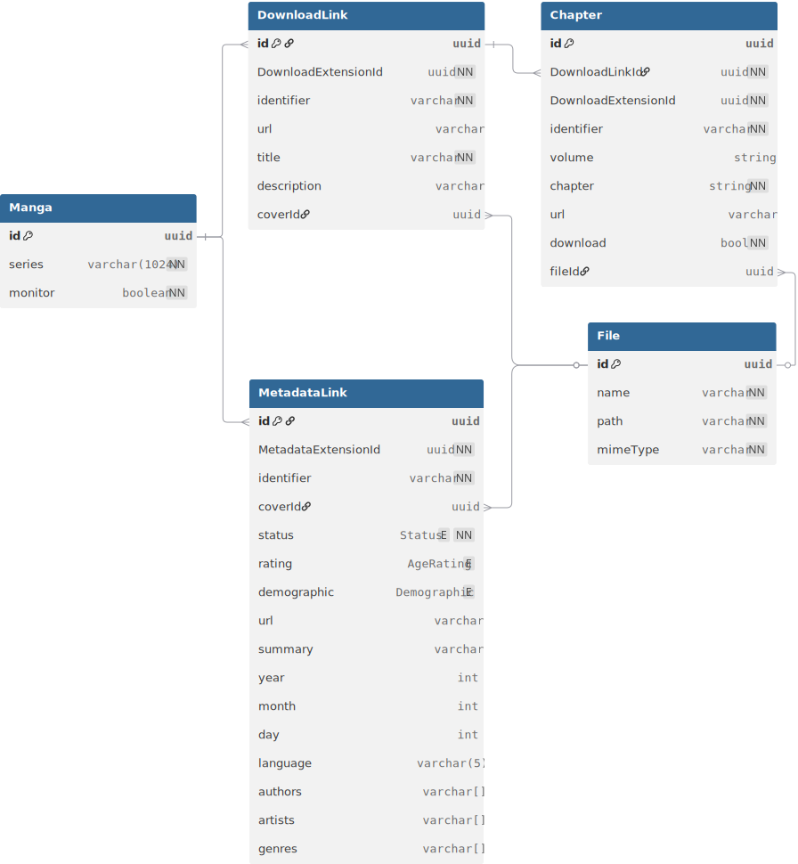

# Contributing

If you want to contribute, please feel free to fork and create a Pull-Request!

## General rules (Codestyle)

- Use explicit types for your variables. This improves readability.
    - **DO**
      ```csharp
      Manga[] zyx = Object.GetAnotherThing(); //I can see that zyx is an Array, without digging through more code
      ```
    - **DO _NOT_**
      ```csharp
      var xyz = Object.GetSomething(); //What is xyz? An Array? A string? An object?
      ```
      
## Database Schema



## Adding a `DownloadExtension` (formerly "connector")

1. If you have the OpenApi-definition use `NSwagClients.Generator` (see _`NSwagClients/Program.cs`_) to generate client code.
2. Extend an `IDownloadExtension` in `DownloadExtensions/Extensions` (for an example see 
_`DownloadExtensions/Extensions/MangaDex.cs`_).
3. Add Tests by extending `IDownloadExtensionsTests` in _`DownloadExtensions.Tests/Extensions`_ (for an example see 
_`DownloadExtensions.Tests/Extensions/MangaDexTests.cs`_).
4. Add the `IDownloadExtension` to `DownloadExtensionsCollection` (_`DownloadExtensions/DownloadExtensionsCollection.cs`_).

## Adding an `MetadataExtension`

1. If you have the OpenApi-definition use `NSwagClients.Generator` (see _`NSwagClients/Program.cs`_) to generate client code.
2. Extend an `IMetadataExtension` in `MetadataExtensions/Extensions` (for an example see
   _`MetadataExtensions/Extensions/MangaUpdates.cs`_).
3. Add Tests by extending `IMetadataExtensionsTests` in _`MetadataExtensions.Tests/Extensions`_ (for an example see
   _`MetadataExtensions.Tests/Metadata/MangaUpdatesTests.cs`_).
4. Add the `IMetadataExtension` to `MetadataExtensionsCollection` (_`MetadataExtensions/MetadataExtensionsCollection.cs`_).