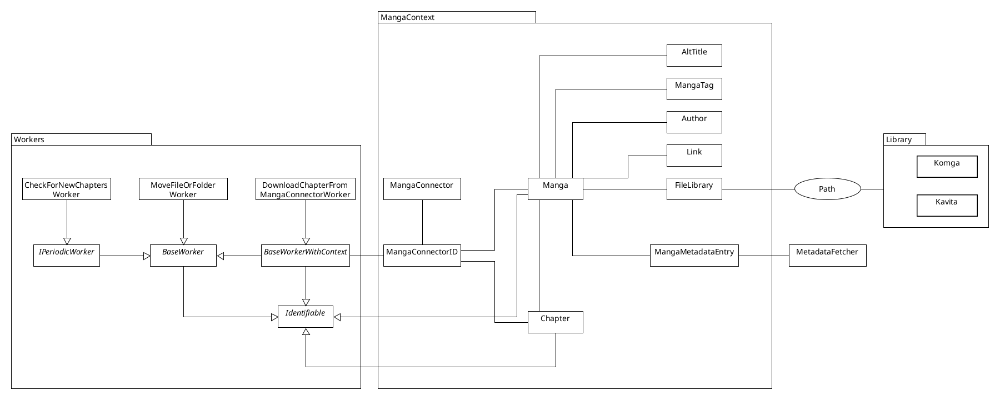

## Contributing

If you want to contribute, please feel free to fork and create a Pull-Request!

### General rules (Codestyle)

- Use explicit types for your variables. This improves readability.
    - **DO**
      ```csharp
      Manga[] zyx = Object.GetAnotherThing(); //I can see that zyx is an Array, without digging through more code
      ```
    - **DO _NOT_**
      ```csharp
      var xyz = Object.GetSomething(); //What is xyz? An Array? A string? An object?
      ```

- Indent your `if` and `for` blocks
    - **DO**
      ```csharp
      if(true)
        return false;
      ```
    - **DO _NOT_**
      ```csharp
      if(true) return false;
      ```
      <details>
        <summary>Because try reading this</summary>

        ```csharp
        if (s.StartsWith("http://", StringComparison.OrdinalIgnoreCase) || s.StartsWith("https://", StringComparison.OrdinalIgnoreCase)) return s;
        ```

      </details>

- When using shorthand, _this_ improves readability for longer lines (at some point just use if-else...):
```csharp
bool retVal = xyz is true
    ? false
    : true;
```
```csharp
bool retVal = xyz?
    ?? abc?
    ?? true;
```

### If you want to add a new Website-Connector:

1. Copy one of the existing connectors, or start from scratch and inherit from `API.Schema.MangaConnectors.MangaConnector`.
2. Add the new Connector as Object-Instance in `Tranga.cs` to the MangaConnector-Array `connectors`.
3. Add the discriminator to the `MangaContext.cs` `MangaConnector`-Entity

### Database and EF Core

Tranga is using a **code-first** EF-Core approach. If you modify the database(context) schema you need to create a migration.

###### Configuration Environment-Variables:

| variable          | default-value    |
|-------------------|------------------|
| POSTGRES_HOST     | `tranga-pg:5432` |
| POSTGRES_DB       | `postgres`       |
| POSTGRES_USER     | `postgres`       |
| POSTGRES_PASSWORD | `postgres`       |

### A broad overview of where is what:



- `Program.cs` Configuration for ASP.NET, Swagger (also in `NamedSwaggerGenOptions.cs`)
- `Tranga.cs` Worker-Logic
- `Schema/**` Entity-Framework Schema Definitions
- `MangaDownloadClients/**` Networking-Clients for Scraping
- `Controllers/**` ASP.NET Controllers (Endpoints)

### How to test locally

In the Project root a `docker-compose.local.yaml` file will spin up a Postgres Database with the correct settings.
The [launchsettings.json](https://github.com/C9Glax/tranga/blob/main/API/Properties/launchSettings.json) will take care of the ENV vars for the API.
