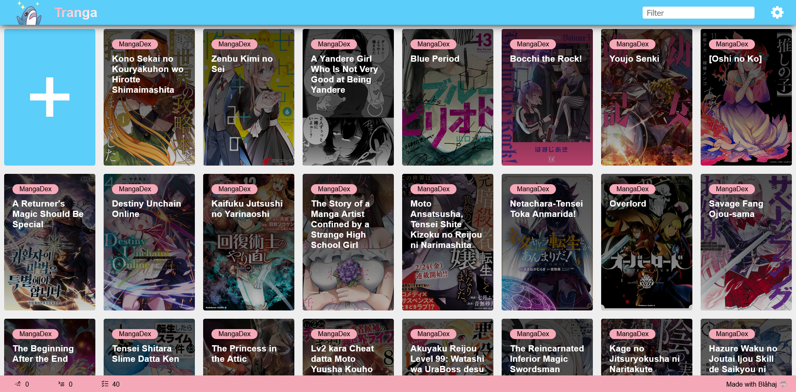
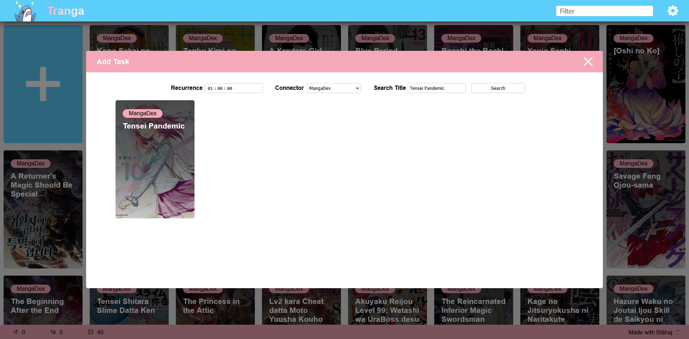
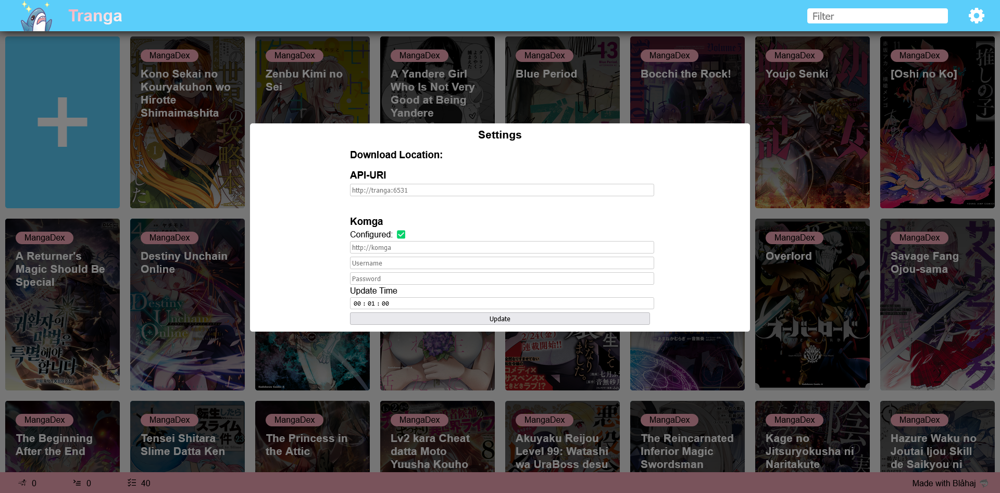
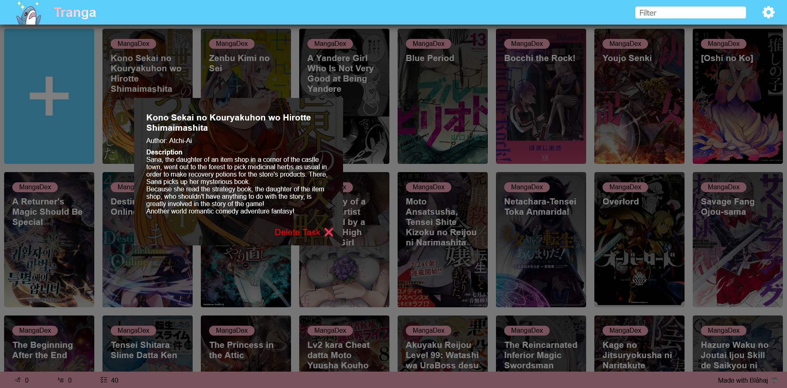

<!-- PROJECT SHIELDS -->
<!--
*** I'm using markdown "reference style" links for readability.
*** Reference links are enclosed in brackets [ ] instead of parentheses ( ).
*** See the bottom of this document for the declaration of the reference variables
*** for contributors-url, forks-url, etc. This is an optional, concise syntax you may use.
*** https://www.markdownguide.org/basic-syntax/#reference-style-links
-->

<!-- PROJECT LOGO -->
 

<h3 align="center">Tranga</h3>

  

    Automatic Manga and Metadata downloader 
  

<!-- TABLE OF CONTENTS -->

  
Table of Contents

  <ol>
    <li>
      <a href="#about-the-project">About The Project</a>
      <ul>
        <li><a href="#built-with">Built With</a></li>
      </ul>
    </li>
    <li>
      <a href="#screenshots">Screenshots</a>
    </li>
    <li>
      <a href="#getting-started">Getting Started</a>
      <ul>
        <li><a href="#prerequisites">Prerequisites</a></li>
      </ul>
    </li>
    <li><a href="#roadmap">Roadmap</a></li>
    <li><a href="#contributing">Contributing</a></li>
    <li><a href="#license">License</a></li>
    <li><a href="#acknowledgments">Acknowledgments</a></li>
  </ol>

<!-- ABOUT THE PROJECT -->
## About The Project

Tranga can download Chapters and Metadata from Scanlation sites such as 

- [MangaDex.org](https://mangadex.org/)
- [Manganato.com](https://manganato.com/)

and automatically start updates in [Komga](https://komga.org/) to import them.

### Inspiration:

Because [Kaizoku](https://github.com/oae/kaizoku) was relying on [mangal](https://github.com/metafates/mangal) and mangal
hasn't received bugfixes for it's issues with Titles not showing up, or throwing errors because of illegal characters,
there were no alternatives for automatic downloads. However [Kaizoku](https://github.com/oae/kaizoku) certainly had a great Web-UI.

That is why I wanted to create my own project, in a language I understand, and that I am able to maintain myself.

(<a href="#readme-top">back to top</a>)

### Built With

- .NET-Core
- Newtonsoft.JSON
- Love <3 Blåhaj 🦈

(<a href="#readme-top">back to top</a>)

## Screenshots

|  |  |
|-----------------------------------:|:-------------------------------------------------:|

(<a href="#readme-top">back to top</a>)

<!-- GETTING STARTED -->
## Getting Started

There is two release types:

- CLI
- Docker

### CLI

Head over to [releases](https://git.bernloehr.eu/glax/Tranga/releases) and download. The CLI will guide you through setup.

### Docker

Download [docker-compose.yaml](https://git.bernloehr.eu/glax/Tranga/src/branch/master/docker-compose.yaml) and configure to your needs.

Wherever you are mounting `/usr/share/Tranga-API` you also need to mount that same path + `/imageCache` in the webserver container.

### Prerequisites

[.NET-Core 7.0](https://dotnet.microsoft.com/en-us/download/dotnet/7.0)

<!-- ROADMAP -->
## Roadmap

- [x] Web-UI #1
- [ ] More Connectors
  - [ ] Manganato #2
- [ ] ? 

See the [open issues](https://git.bernloehr.eu/glax/Tranga/issues) for a full list of proposed features (and known issues).

(<a href="#readme-top">back to top</a>)

<!-- CONTRIBUTING -->
## Contributing

The following is copy & pasted:

Contributions are what make the open source community such an amazing place to learn, inspire, and create. Any contributions you make are **greatly appreciated**.

If you have a suggestion that would make this better, please fork the repo and create a pull request. You can also simply open an issue with the tag "enhancement".
Don't forget to give the project a star! Thanks again!

1. Fork the Project
2. Create your Feature Branch (`git checkout -b feature/AmazingFeature`)
3. Commit your Changes (`git commit -m 'Add some AmazingFeature'`)
4. Push to the Branch (`git push origin feature/AmazingFeature`)
5. Open a Pull Request

(<a href="#readme-top">back to top</a>)

<!-- LICENSE -->
## License

Distributed under the GNU GPLv3  License. See `LICENSE.txt` for more information.

(<a href="#readme-top">back to top</a>)

<!-- ACKNOWLEDGMENTS -->
## Acknowledgments

* [Choose an Open Source License](https://choosealicense.com)
* [Font Awesome](https://fontawesome.com)
* [Best-README-Template](https://github.com/othneildrew/Best-README-Template/tree/master)

(<a href="#readme-top">back to top</a>)

