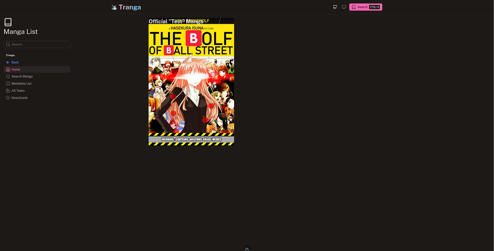
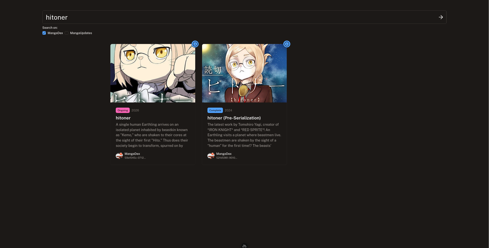
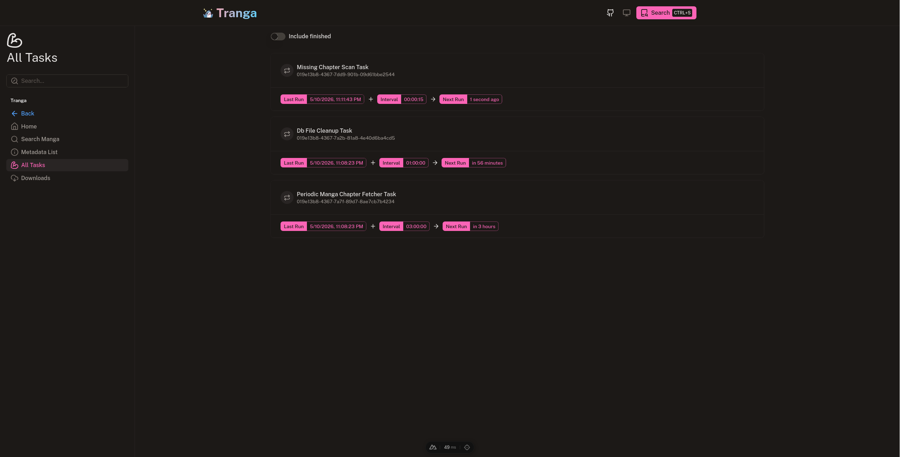
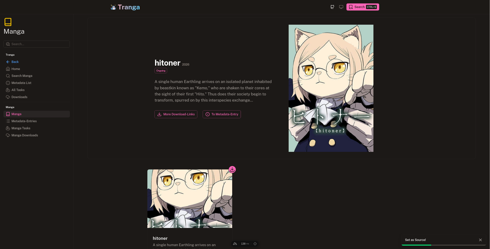
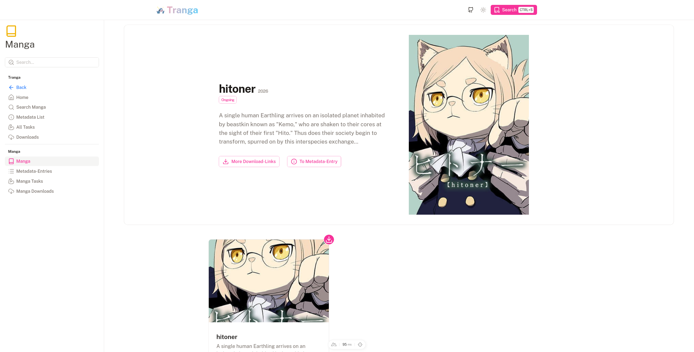

<span id="readme-top"></span>
<div align="center">

  <h1 align="center">Tranga</h1>
  <p align="center">
    Automatic Manga and Metadata downloader 
  </p>


  <table>
    <tr>
      <th></th>
      <td></td>
    </tr>
    <tr>
      <th></th>
      <td></td>
    </tr>
    <tr>
      <th></th>
      <td></td>
    </tr>
    <tr>
      <th></th>
      <td></td>
    </tr>
  </table>

</div>

## Features

- [x] Monitor providers for new chapters and download new ones
- [x] Enrich Manga and chapters with Metadata from third-party websites
- [x] Flaresolverr support
- [x] Notifications
  - Using [Naprise](https://github.com/Genteure/naprise)
    - Gotify
    - Telegram
    - Discord
    - Ntfy.sh
    - ...

#### TODO LIST

- [ ] Unified webpage scraper ([Common/Helpers/RequestClient.cs](Common/Helpers/RequestClient.cs))
- [ ] Accounts (Authorization) (`Services.Users`)
- [ ] Existing chapter mapping (`Services.Manga`)
- [ ] Library-support (`Services.Libraries`, `Extensions`) (_Komga_)

## Getting started

- [docker-compose.yaml](docker-compose.yaml) You probably do not want to modify this. Use the `.env` file for configuration.
- [.env](.env)
  - [Environment Variables](EnvVars.md)

`Mangas` is bind-mounted from the host path set in `MangaDirectory`, so it keeps whatever ownership that host directory already has. The services write to it as a non-root container user (UID/GID `1654`), so if you hit `UnauthorizedAccessException`/`Permission denied` errors on download, chown the host directory before starting the stack:

```bash
sudo chown -R 1654:1654 /path/to/your/Manga
```

## Screenshots







## Built With

**💙 [Blåhaj](https://www.ikea.com/us/en/p/blahaj-soft-toy-shark-90373590/) 🦈**
- [ASP.NET](https://dotnet.microsoft.com/en-us/apps/aspnet)
  - [EF Core](https://learn.microsoft.com/en-us/ef/core/)
- [PostgreSQL](https://www.postgresql.org/about/licence/)
  - [Ngpsql](https://github.com/npgsql/npgsql/blob/main/LICENSE)
- [Sixlabors.ImageSharp](https://docs-v2.sixlabors.com/articles/imagesharp/index.html#license)
- [FlareSolverr](https://github.com/FlareSolverr/FlareSolverr)
  - [FlareSolverrSharp](https://github.com/FlareSolverr/FlareSolverrSharp)
- [Naprise](https://github.com/Genteure/naprise)
- [BuildInformation](https://github.com/linkdotnet/BuildInformation)
- [GitInfo](https://github.com/devlooped/GitInfo)
- [xUnit](https://xunit.net/index.html?tabs=cs)
- [XmlSchemaClassGenerator](https://github.com/mganss/XmlSchemaClassGenerator)
- [NSwag](https://github.com/RicoSuter/NSwag)
- [Html Agility Pack (HAP)](https://github.com/zzzprojects/html-agility-pack/blob/master/LICENSE)
- [Nuxt](https://nuxt.com/)
  - [Nuxt UI](https://ui.nuxt.com/)
- [TailwindCSS](https://tailwindcss.com/)
- [Lucide](https://lucide.dev/)

<p align="right">(<a href="#readme-top">back to top</a>)</p>

## Star History

<a href="https://www.star-history.com/?type=date&repos=c9glax%2Ftranga">
 <picture>
   <source media="(prefers-color-scheme: dark)" srcset="https://api.star-history.com/chart?repos=c9glax/tranga&type=date&theme=dark&legend=top-left&sealed_token=VbMkUY1g0Rt0cT5bw0BVpVuK-HuG5UfMb-tt-AWbnWEZ71V1dCCM4hO8SBJuw7jfkpRXM4URm4Djm-jPoJ29CJjW-y8xDQZu1FtqIdgxbnbcEmIfAsFpGwUBbGwayoz7S7EwYaIjk7OoMz5z_Gd_ITaxUuESPxvjlAuZ5chRI5wtJB9vi7Lo6a7clWeP" />
   <source media="(prefers-color-scheme: light)" srcset="https://api.star-history.com/chart?repos=c9glax/tranga&type=date&legend=top-left&sealed_token=VbMkUY1g0Rt0cT5bw0BVpVuK-HuG5UfMb-tt-AWbnWEZ71V1dCCM4hO8SBJuw7jfkpRXM4URm4Djm-jPoJ29CJjW-y8xDQZu1FtqIdgxbnbcEmIfAsFpGwUBbGwayoz7S7EwYaIjk7OoMz5z_Gd_ITaxUuESPxvjlAuZ5chRI5wtJB9vi7Lo6a7clWeP" />
   
 </picture>
</a>

### Prerequisits

[.NET 10](https://dotnet.microsoft.com/en-us/download/dotnet/10.0)

<!-- CONTRIBUTING -->
## Contributing

If you want to contribute, please feel free to fork and create a Pull-Request!

Please read [CONTRIBUTING](CONTRIBUTING.md)

## License

Distributed under the GNU GPLv3  License. See [LICENSE](https://github.com/C9Glax/tranga/blob/main/LICENSE) for more information.

## Acknowledgments

* [Choose an Open Source License](https://choosealicense.com)
* [Best-README-Template](https://github.com/othneildrew/Best-README-Template/tree/master)
* [Shields.io](https://shields.io/)
